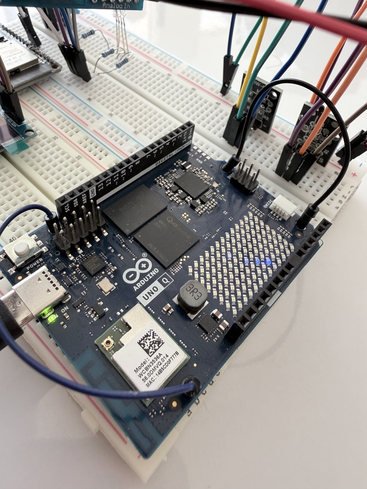
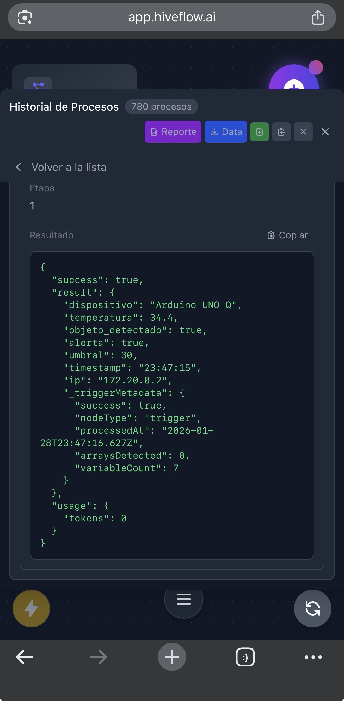

# 🤖 Arduino UNO Q - IoT Dashboard + Webhook

A dual-brain IoT monitoring system using the Arduino UNO Q (Qualcomm Dragonwing + STM32) with a real-time web dashboard and [HiveFlow](https://hiveflow.ai) webhook integration.


## 📋 Overview

This project showcases the unique dual-brain architecture of the Arduino UNO Q:

- **MCU (STM32U585)**: Reads sensors, controls LED matrix, sends JSON data
- **MPU (Qualcomm QRB2210)**: Runs Python Flask dashboard, handles WiFi, sends webhooks

### Features

- 🌡️ Real-time temperature monitoring with HW-498 thermistor
- 👁️ Object detection with HW-487 photo interrupter
- 📺 Built-in 8x13 LED matrix status display
- 🌐 Web dashboard accessible from any browser
- 📡 Automatic webhook POST to HiveFlow every 30 seconds
- 🔄 Auto-reconnect and error handling

## 📸 Demo



## 🔧 Hardware Requirements

| Component | Model | Description |
|-----------|-------|-------------|
| Main Board | Arduino UNO Q | Qualcomm QRB2210 + STM32U585 |
| Temperature Sensor | HW-498 | Analog thermistor |
| Object Sensor | HW-487 | Photo interrupter |

### Built-in Features (No External Hardware Needed)

- 8x13 RGB LED Matrix
- 4 RGB Status LEDs
- WiFi 5 dual-band
- Bluetooth 5.1
- 2GB RAM, 16GB eMMC

## 📊 Architecture

```
┌─────────────────────────────────────────────────────────────┐
│                    ARDUINO UNO Q                            │
│  ┌─────────────────────┐    ┌─────────────────────────┐    │
│  │    MCU (STM32)      │    │    MPU (Qualcomm)       │    │
│  │                     │    │                         │    │
│  │  • Read HW-498     ─┼────┼→ • Flask Dashboard     │    │
│  │  • Read HW-487      │    │  • HTTP Webhook        │    │
│  │  • LED Matrix       │    │  • WiFi Management     │    │
│  │  • JSON Serial      │    │  • Linux OS            │    │
│  │                     │    │                         │    │
│  │  Arduino Sketch     │    │  Python Script         │    │
│  └─────────────────────┘    └───────────┬─────────────┘    │
│                                         │                   │
└─────────────────────────────────────────┼───────────────────┘
                                          │ WiFi
                                          ▼
                               ┌─────────────────────┐
                               │     HiveFlow        │
                               │     Webhook         │
                               │                     │
                               │  Trigger → Flow     │
                               │         → Action    │
                               └─────────────────────┘
```

## 🔌 Wiring Diagram

Only 2 external sensors needed - everything else is built-in!

### HW-498 (Thermistor)
| Sensor Pin | UNO Q Pin |
|------------|-----------|
| S (Signal) | A0 |
| + | 5V |
| - | GND |

### HW-487 (Photo Interrupter)
| Sensor Pin | UNO Q Pin |
|------------|-----------|
| S (Signal) | D2 |
| + | 5V |
| - | GND |

## 🚀 Installation

### Prerequisites

- [Arduino App Lab](https://lab.arduino.cc/) installed
- Arduino UNO Q connected via USB-C

### Step 1: Clone or Download

```bash
git clone https://github.com/johnolven/arduino-uno-q-iot-dashboard.git
```

Or download and extract the ZIP file.

### Step 2: Open in Arduino App Lab

1. Open **Arduino App Lab**
2. Click **File → Open Folder**
3. Select the `arduino-uno-q-iot-dashboard` folder
4. The project structure should appear:

```
📁 arduino-uno-q-iot-dashboard/
├── 📁 sketch/
│   ├── sketch.ino
│   └── sketch.yaml
├── 📁 python/
│   ├── main.py
│   └── requirements.txt
├── 📁 docs/
│   └── WIRING.txt
├── app.yaml
└── README.md
```

### Step 3: Configure

Edit `python/main.py` and change the webhook URL:

```python
WEBHOOK_URL = "https://api.hiveflow.ai/api/triggers/flow/YOUR_FLOW_ID/YOUR_TOKEN"
```

### Step 4: Configure WiFi

1. In Arduino App Lab, go to **Settings → Network**
2. Connect your UNO Q to your WiFi network

### Step 5: Run

1. Click **Run** in Arduino App Lab
2. Both MCU sketch and Python script will start automatically
3. Open the dashboard URL shown in the console

## 📡 JSON Format

### MCU → MPU (Serial Bridge)

```json
{
  "temperature": 25.50,
  "object_detected": false,
  "alert": false,
  "threshold": 30.0
}
```

### MPU → Webhook (HTTP POST)

```json
{
  "device": "Arduino UNO Q",
  "temperature": 25.50,
  "object_detected": false,
  "alert": false,
  "threshold": 30.0,
  "timestamp": "14:30:45",
  "ip": "192.168.1.100"
}
```

## ⚙️ Configuration

### Temperature Threshold

In `sketch/sketch.ino`:
```cpp
const float TEMP_THRESHOLD = 30.0;  // Change value (°C)
```

### Webhook Interval

In `python/main.py`:
```python
WEBHOOK_INTERVAL = 30  # Seconds
```

### Dashboard Port

In `python/main.py`:
```python
DASHBOARD_PORT = 5000  # Change if needed
```

## 🌐 Accessing the Dashboard



### Local Network

Open a browser and go to:
```
http://[UNO_Q_IP]:5000
```

The IP is displayed in the console when the app starts.

### Public Access (via ngrok)

1. SSH into your UNO Q or use the terminal
2. Install ngrok:
   ```bash
   curl -s https://ngrok-agent.s3.amazonaws.com/ngrok-v3-stable-linux-arm64.tgz | tar xz
   sudo mv ngrok /usr/local/bin/
   ```
3. Run ngrok:
   ```bash
   ngrok http 5000
   ```
4. Use the provided public URL

## 🔍 LED Matrix Patterns

| State | Pattern |
|-------|---------|
| Normal | ✓ Check mark |
| Object Detected | □ Square outline |
| Alert (High Temp) | ✗ X pattern |

## 🐛 Troubleshooting

### Dashboard not accessible

- Check WiFi connection in Settings → Network
- Verify the IP address shown in console
- Try `http://localhost:5000` if on the same device

### Webhook errors

- Verify webhook URL is correct
- Test with [webhook.site](https://webhook.site) first
- Check network connectivity

### Sensors not reading

- Verify wiring (HW-498 → A0, HW-487 → D2)
- Check 5V and GND connections
- Ensure sensors are powered

### App Lab not running

- Check USB-C connection (use Debug port)
- Restart Arduino App Lab
- Update to latest version

## 📁 Project Structure

```
arduino-uno-q-iot-dashboard/
├── sketch/                      # MCU code (STM32)
│   ├── sketch.ino              # Arduino sketch
│   └── sketch.yaml             # Sketch configuration
├── python/                      # MPU code (Qualcomm)
│   ├── main.py                 # Flask dashboard + webhook
│   └── requirements.txt        # Python dependencies
├── docs/
│   └── WIRING.txt              # Wiring diagram
├── app.yaml                     # App Lab configuration
├── README.md
└── LICENSE
```

## 🔄 Arduino UNO Q vs Other Boards

| Feature | UNO Q | UNO R3 | ESP32 |
|---------|-------|--------|-------|
| WiFi | Built-in ✅ | No | Built-in ✅ |
| Linux | Yes ✅ | No | No |
| Python | Yes ✅ | No | No |
| Web Server | Native ✅ | Needs bridge | Yes |
| LED Matrix | Built-in ✅ | External | External |
| RAM | 2GB | 2KB | 520KB |
| Processing | Quad-core 2GHz | 16MHz | 240MHz |

## 🤝 Contributing

1. Fork the repository
2. Create a branch (`git checkout -b feature/new-feature`)
3. Commit your changes (`git commit -am 'Add new feature'`)
4. Push to the branch (`git push origin feature/new-feature`)
5. Open a Pull Request

## 📄 License

This project is licensed under the MIT License - see the [LICENSE](LICENSE) file for details.

## 👤 Author

**John Olven**
- GitHub: [@johnolven](https://github.com/johnolven)
- Project: [HiveFlow](https://hiveflow.ai)

## 🔗 Related Projects

- [Arduino Temperature Monitor + Webhook](https://github.com/johnolven/hiveflow-iot-arduino-uno-r3) - Arduino UNO R3 version
- [ESP32 Temperature Monitor + Webhook](https://github.com/johnolven/hiveflow-iot-esp32) - ESP32 version

---

⭐ If you found this project useful, please give it a star on GitHub!
